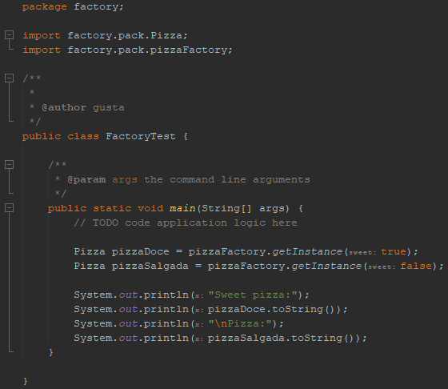

<h1 align="center">Java-padraoDeProjeto</h1>

## 📖 About the project
This project from the Santander Bootcamp | Fullstack Developer at DIO aims to deepen the understanding and application of design patterns in the BackEnd. By implementing the Factory and Strategy patterns, it seeks to provide a flexible interface for object creation and the ability to dynamically choose specific algorithms at runtime. The Factory pattern simplifies the creation of different types of objects, while the Strategy pattern allows the dynamic exchange of algorithms, promoting cohesion and facilitating system maintenance. This project represents a valuable opportunity to enhance skills in BackEnd design patterns, resulting in a more flexible and sustainable architecture.

### Project structure:


### Factory test:


### Strategy test:


## 🦾 Technologies used
<div style="display: flex;">
 


</div>

## 🤔 What i learned
- Design Patterns: Acquired in-depth knowledge of design patterns, understanding their application in building flexible and maintainable software architectures.
- Class Relationships: Explored and mastered the intricacies of establishing effective relationships between classes, optimizing code structure for better organization and readability.
- Hierarchy Mastery: Developed a solid grasp of hierarchical structures, enabling the creation of scalable and well-organized codebases.
- Polymorphism: Explored and implemented polymorphic behaviors, allowing for more dynamic and versatile interactions between different components of the system.
- Inheritance Proficiency: Enhanced proficiency in utilizing inheritance, leveraging its benefits for code reuse and building upon existing class functionalities.

## 🧑‍🎓 Authors
- <a href="https://github.com/DevGustavus"> Gustavo Machado Pontes - DevGustavus </a>

## 👽 How to clone this project

````bash
    # Select where you want to clone
    $ cd ~/Documents/WHERE_YOU_WANT
````

````bash
    # Clone the project
    $ git clone https://github.com/DevGustavus/REPOSITORY_NAME.git
````

````bash
    # Check if cloning worked fine
    $ cd ~/Documents/DIRECTORY_LOCATION
    $ ls
````
